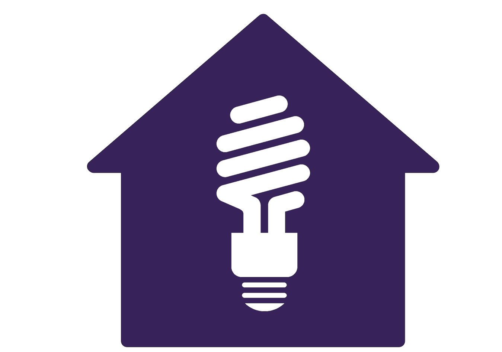
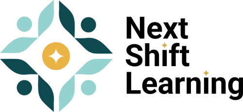

<!--
  GitHub-safe version: uses embedded SVG banners and basic HTML
  (GitHub strips inline styles, so this preserves the design visually).
-->

<!-- 🌊 HEADER WAVE -->

  

<h1 align="center">Hi I'm Alexis Gonzalez</h1>
<h3 align="center">Fullstack Engineer | Technical Instructor | Program Director</h3>
<h4 align="center">📍 Based in Los Angeles, California</h4>

---

  Passionate about building scalable web applications and mentoring the next generation of engineers.  
  I transitioned from a premedical background to software engineering after witnessing how technology can improve lives through innovation.  

  <a href="https://vercel-react-app-black.vercel.app/">
     <b>Visit my portfolio</b>
  </a>

---

## Professional Background

I'm a **Fullstack Engineer and Technical Instructor** with experience leading and supporting engineering programs at organizations like  
**Snap Inc.**, **The Knowledge House**, and **Program Equity**.

My work spans teaching, open-source leadership, and software development using technologies like  
**React**, **Node.js**, **Express**, **Next.js**, **MongoDB**, **Supabase**, and **React Native**.

<ul>
  <li>
    
    <strong> Snap Inc – Engineering Academy Instructor:</strong>
    Delivered fullstack and AI integration curricula using React, React Native, and APIs; achieved 100% student retention.
  </li>
  <li>
    
    <strong> Program Equity – Director of Open Source Fellowship:</strong>
    Led open-source initiatives, managed 80+ fellows, and implemented process improvements that increased program efficiency.
  </li>
  <li>
    
    <strong> The Knowledge House – Web Dev TA:</strong>
    Provided live debugging, curriculum support, and mentorship, increasing retention by 15%.
  </li>
  <li>
    
    <strong> Next Shift Learning – Engineering Consultant:</strong>
    Designed scalable technical assessments and learning materials for engineering candidates.
  </li>
</ul>

---

## Technical Skills

**Languages:** JavaScript (ES6+), HTML5, CSS  
**Frontend:** React, Next.js, Bootstrap, Tailwind CSS  
**Backend:** Node.js, Express.js, Supabase, MongoDB, SQL, Prisma  
**Dev Tools:** Git, GitHub, Docker, Postman, AWS, Heroku  
**Other:** RESTful APIs, Test-Driven Development, Agile Instruction, Curriculum Design

---

## Connect With Me

  
   
  <b><a href="https://www.linkedin.com/in/alexis-gonzalez-866801125" style="color:#CADD57;">LinkedIn</a></b>

---

<!--  FOOTER WAVE -->

  

