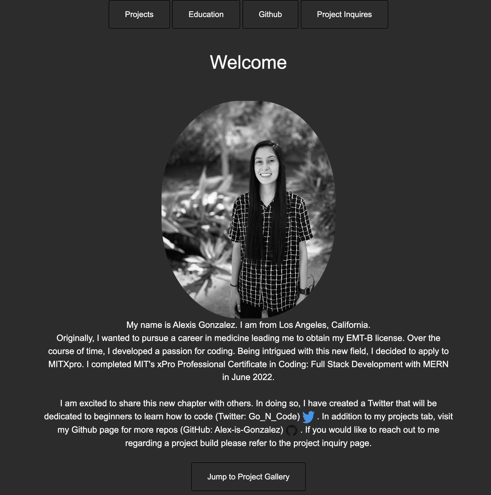
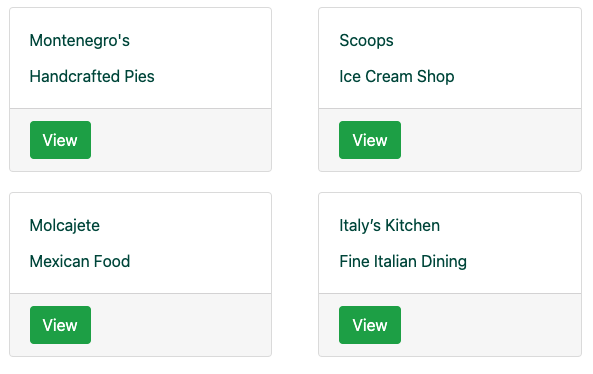

<h1 align="center">Hi 👋, I'm Alexis Gonzalez.</h1>
<h3 align="center">A FullStack Engineer from Los Angeles, California.</h3>

Previously a premedical student, I was motivated by the power of technology as a tool that positively impacted and saved lives. Due to this, I transitioned to Fullstack Engineering to be part of the innovation! Visit <a href="https://alex-is-gonzalez.github.io/index.html">my website </a> for more information!

<h1 align="center"> Highlighted Projects</h1>
<table bordercolor="ffffff">
  
  <tr>
    <td width="50%" valign="top">
      <h3 align="center">Book Tracker</h3>
         
        
         
        

          
    
  
      

        
<strong>Javascript, CSS3, HTML5 </strong> - Platform to help third grade students track the books they have read during the school year.

    </td>
    <td width="50%" valign="top">
      <h3 align="center">React Banking App</h3>
         
      
         
        

          
  
  
      

        
<strong>Javascript, React, CSS5, Bootstrap</strong> - The Frontend of an app called BadBank.This app is a single page application which uses React to maintain the state of the Bad Bank App

    </td>
  </tr>
  
  <tr>
    <td width="50%" valign="top">
      <h3 align="center">Alex-is-Gonzalez.io</h3>
       
        
       
        

  
  
      

        
<strong>HTML5, CSS3 </strong> - Portfolio Site including links to my projects and ways to contract myself for your next project.

    </td>
    <td width="50%" valign="top">
      <h3 align="center">Ivy</h3>
         
        
         
        

          
  
  
      

        
<strong>HTML5, CSS3, Javascript, Nextjs, MongoDB, Heroku, Stripe</strong>- A fullstack app for ordering food online.

    </td>
  </tr>
</table>

<h1 align="center">Connect With Me</h1>

<h1 align="center">Technologies</h1>

                

